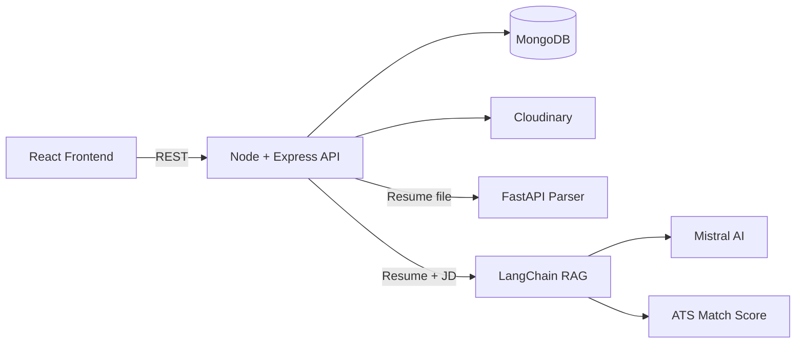
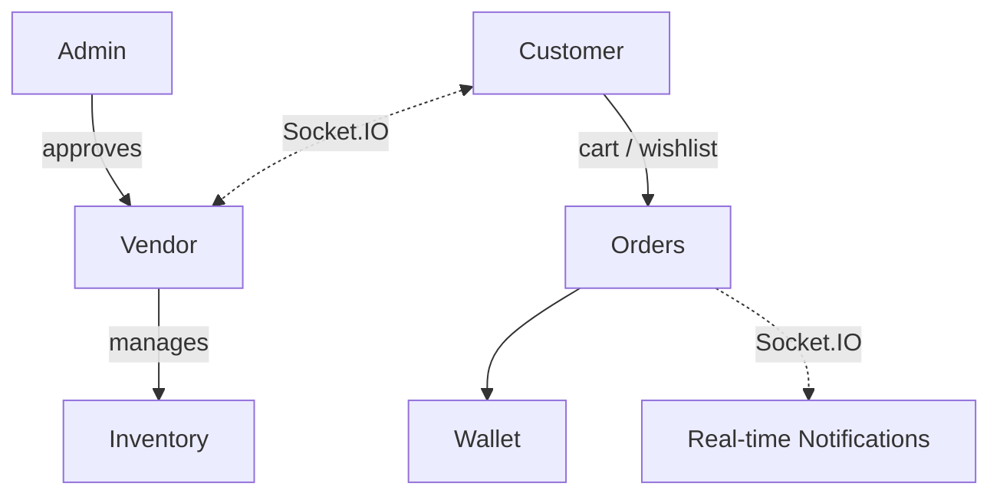
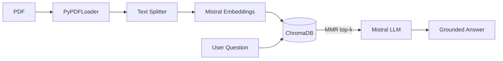
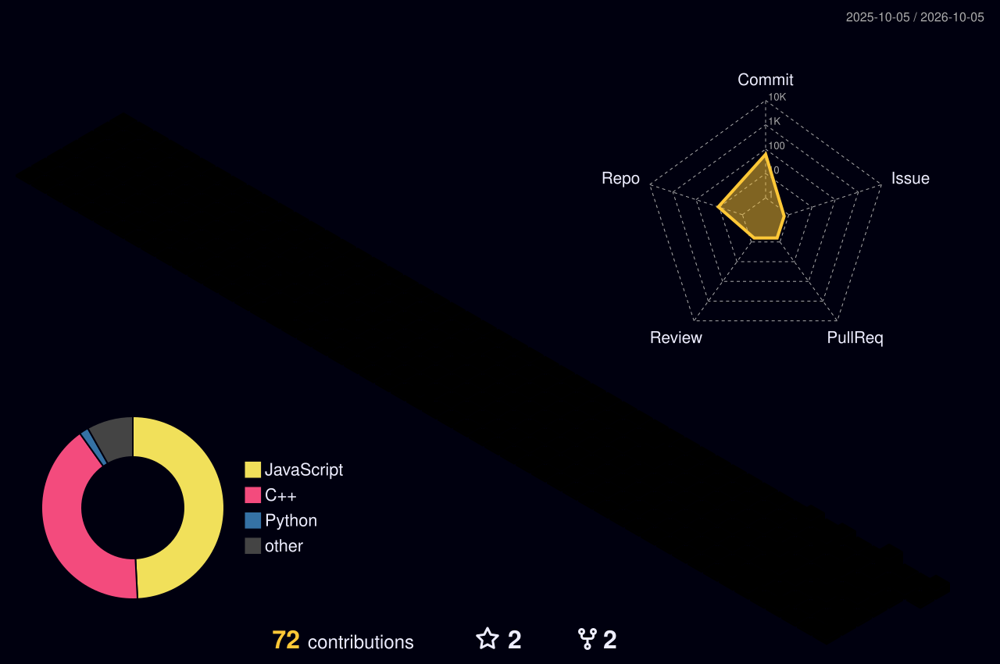

<!-- ═══════════════ HEADER ═══════════════ -->


<p align="center">
  <a href="https://github.com/siddharth-k12">
    
  </a>
</p>

<p align="center">
  
  
  
</p>

<p align="center">
  <a href="https://www.linkedin.com/in/siddhartha-kumar-5616802b6/"></a>
  <a href="mailto:siddharthkumar00021@gmail.com"></a>
  <a href="https://github.com/siddharth-k12"></a>
  <a href="https://jobprotal-frontend-tptp.onrender.com/"></a>
</p>

---

## 👨‍💻 About Me

```js
const siddhartha = {
  role: "Backend-Focused Full Stack Developer",
  location: "New Delhi, India 🇮🇳",
  education: ["MCA (AI & ML) — Chandigarh University, 2026–2028", "BCA — Mangalmay Group, 2023–2026"],
  coreStack: ["Node.js", "Express.js", "MongoDB", "Python", "FastAPI", "React.js"],
  superpowers: ["REST APIs", "JWT + RBAC", "RAG Pipelines", "Embeddings", "Vector Search", "LLM Integration"],
  currentlyLearning: "Going deeper into AI & Machine Learning 🧠",
  funFact: "I like APIs that never return 500 😄",
};
```

---

## 🛠️ Tech Arsenal

<table align="center">
  <tr>
    <td align="center" width="140"><b>💻 Languages</b></td>
    <td>
      
    </td>
  </tr>
  <tr>
    <td align="center"><b>⚙️ Backend</b></td>
    <td>
      
      
      
    </td>
  </tr>
  <tr>
    <td align="center"><b>🎨 Frontend</b></td>
    <td>
      
    </td>
  </tr>
  <tr>
    <td align="center"><b>🗄️ Databases</b></td>
    <td>
      
      
    </td>
  </tr>
  <tr>
    <td align="center"><b>🤖 GenAI / RAG</b></td>
    <td>
      
      
      
    </td>
  </tr>
  <tr>
    <td align="center"><b>🧰 Tools</b></td>
    <td>
      
    </td>
  </tr>
</table>

---

## 🚀 Featured Projects

<table>
  <tr>
    <td width="50%" valign="top">
      <a href="https://github.com/siddharth-k12/Jobprotal">
        
      </a>
    </td>
    <td width="50%" valign="top">
      <a href="https://github.com/siddharth-k12/multi-vendor">
        
      </a>
    </td>
  </tr>
  <tr>
    <td colspan="2" align="center">
      <a href="https://github.com/siddharth-k12/Rag-Project">
        
      </a>
    </td>
  </tr>
</table>

<details>
<summary><b>🔹 AI-Powered Job Portal</b> &nbsp;·&nbsp; <a href="https://jobprotal-frontend-tptp.onrender.com/">Live Demo ↗</a> &nbsp;<i>(click to expand)</i></summary>
<br>

`React.js` `Node.js` `Express.js` `MongoDB` `FastAPI` `LangChain` `RAG`

- 🔌 **20+ REST endpoints** with clean, modular architecture
- 🔐 **JWT + RBAC** auth with ownership-based access control
- ☁️ **Cloudinary-backed** multi-resume management
- 🐍 **Decoupled Python FastAPI microservice** for resume parsing
- 🧠 **LangChain RAG pipeline** with Mistral AI for ATS-style match scoring



</details>

<details>
<summary><b>🔹 Multi-Vendor Marketplace Backend</b> &nbsp;<i>(click to expand)</i></summary>
<br>

`Node.js` `Express.js` `MongoDB` `Socket.IO` `JWT` `Cloudinary`

- 👥 **Admin / Vendor / Customer** workflows with RBAC-driven vendor onboarding
- 📦 Inventory, cart, wishlist, orders and wallet modules
- ⚡ **Real-time notifications** and **1:1 chat** via Socket.IO



</details>

<details>
<summary><b>🔹 PDF RAG Assistant</b> &nbsp;<i>(click to expand)</i></summary>
<br>

`Python` `LangChain` `Mistral AI` `ChromaDB` `Streamlit`

- 📄 Upload a PDF and ask natural-language questions
- ✂️ **PyPDFLoader + RecursiveCharacterTextSplitter** for chunking
- 🧬 **Mistral embeddings** stored in ChromaDB with **MMR retrieval**
- 🎯 Grounded prompting to reduce hallucinations
- 🧪 Tested via both Streamlit UI and CLI



</details>

---

## 📊 GitHub Stats

<p align="center">
  
  
</p>

<p align="center">
  
</p>

<p align="center">
  
</p>

---

## 🌆 My Contributions in 3D

<p align="center">
  
</p>

> ⚙️ Auto-generated every day by a GitHub Action (`github-profile-3d-contrib`). Taller bars = more commits that day.

---

## 💬 Let's Build Something

<p align="center">
  <i>"Make it work, make it right, make it fast."</i> — Kent Beck
</p>

<p align="center">
  Open to collaborations on <b>backend systems</b>, <b>AI-powered apps</b> and <b>RAG projects</b>.<br>
  Drop a message — I usually reply fast. ⚡
</p>

<p align="center">
  <a href="https://www.linkedin.com/in/siddhartha-kumar-5616802b6/"></a>
  <a href="mailto:siddharthkumar00021@gmail.com"></a>
  <a href="https://github.com/siddharth-k12"></a>
</p>

<p align="center">
  
</p>

